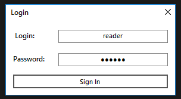
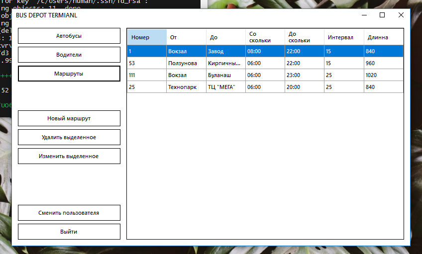
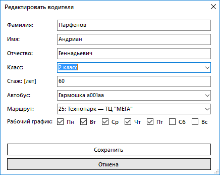

# Курсовая работа РГППУ Парфенов Н.А. ООП 2020г.
> Вариант 6: Автобусный парк
> Требуется разработать программную систему, предназначенную для диспетчера
> автобусного парка. 

**Использовано:**
- C# using Visual Studio
- MongoDB using NoSQLBooster

**Список задач:**

<details>
<summary> развернуть </summary>

- [x] Установка и настройка MongoDB на Windows 10
- [x] Создание двух пользователей с разными правами
- [x] Создание класса C# для взаимодейтсвия с базой данных
- [x] Создание моделей коллекций MongoDB в C#
- [x] Реализовать логин
- [x] Создать форму главной страницы
- [x] Реализовать отображение коллекций на главной странице
- [x] Реализовать удаление выделенной записи по кнопке
- [x] Реализовать добавление нового маршрута
- [ ] Реализовать добавление нового автобуса
- [x] Реализовать добавление нового водителя
- [ ] Реализовать редактирование маршрута
- [ ] Реализовать редактирование автобуса
- [ ] Реализовать редактирование водителя
- [ ] Отображение сводной информации
- [ ] Сделать .gitignore
- [x] Выгрузить базу на удаленный сервер

</details>

## Модели базы данных MongoDB | MongoDB Models:
### **Водитель** *Driver*

| Id | Last Name | Name | Patronymic | Grade | Experience | Salary | Bus Id | Route Id | Schedule |
| --- | --- | --- | --- | --- | --- | --- | --- | --- | --- |
| `ObjectId` | `string` | `string` | `string` | `int` | `int` | `float` | `ObjectId` | `ObjectId` | `List<string>` |
| 5eac42... | Парфенов | Андриан | Геннадьевич | 1 | 5 | 30000 | 5eac42... | 5eac42... | "Пн", "Вт", "Чт", "Пт" |


```csharp
    public partial class Driver
    {
        [BsonId]
        public ObjectId Id { get; set; }
        public string LastName { get; set; }
        public string Name { get; set; }
        public string Patronymic { get; set; }
        public int Grade { get; set; }
        public int Experience { get; set; }
        public float Salary { get; set; }
        public ObjectId BusId { get; set; }
        public ObjectId RouteId { get; set; }
        public List<string> Schedule { get; set; }
        public Driver()
        {
            Id = ObjectId.GenerateNewId();
            Schedule = new List<string>();
        }
    }
```
### **Маршрут** *Route*

| Id | Number | Start Point | End Point | Start Time | End Time | Interval | Lenght |
| --- | --- | --- | --- | --- | --- | --- | --- |
| `ObjectId` | `int` | `string` | `string` | `string` | `string` | `int` | `int` |
| 5ea47... | 25 | Технопарк | ТЦ МЕГА | 06:00 | 20:00 | 25 | 840 |

```csharp
    public partial class Route
    {
        [BsonId]
        public ObjectId Id { get; set; }
        public int Number { get; set; }
        public string StPoint { get; set; }
        public string EndPoint { get; set; }
        public string StTime { get; set; }
        public string EndTime { get; set; }
        public int Interval { get; set; }
        public int Length { get; set; }
        public Route()
        {
            Id = ObjectId.GenerateNewId();
        }
    }
```
### **Автобус** *Bus*

| Id | Number | Type | Capacity | Is Working |
| --- | --- | --- | --- | --- |
| `ObjectId` | `string` | `string` | `int` | `bool` |
| 5e9f0a... | a001aa | Автолайн | 13 | true |

```csharp
    public partial class Bus
    {
        [BsonId]
        public ObjectId Id { get; set; }
        public string Number { get; set; }
        public string Type { get; set; }
        public int Сapacity { get; set; }
        public bool IsWorking { get; set; }
        public Bus()
        {
            Id = ObjectId.GenerateNewId();
        }
    }
```

## Приложение | Application:

### Роли:
- **Диспетчер:**
    login:pwd: (reader:reader)
    права доступа: read-only
- **Администратор:**
    login:pwd: (admin:admin)
    права доступа: read-write
    
### Интерфейс:
- Логин:



- Главный экран:


- Добавление:



### Функции:
**Корректировка коллекций:**
- Добавление документов в коллекцию MongoDB:
```csharp
    public void InsertDocument<T>(string collectionName, T document)
        {
            var collection = db.GetCollection<T>(collectionName);
            collection.InsertOne(document);
        }
```
- Удаление документов из коллекции MongoDB:
```csharp
    public void DeleteDocument<T>(string collectionName, ObjectId id)
        {
            var collection = db.GetCollection<T>(collectionName);
            var filter = Builders<T>.Filter.Eq("Id", id);
            collection.DeleteOne(filter);
        }
```
**Чтение данных из коллекций:**
- Получить все документы коллекции MongoDB:
```csharp
    public List<T> LoadAllDocuments<T>(string collectionName)
        {
            var collection = db.GetCollection<T>(collectionName);
            return collection.Find(new BsonDocument()).ToList();
        }
```
- Получить документ из коллекции MongoDB по ObjectId:
```csharp
    public T LoadDocumentById<T>(string collectionName, ObjectId id)
        {
            var collection = db.GetCollection<T>(collectionName);
            var filter = Builders<T>.Filter.Eq("Id", id);
            return collection.Find(filter).First();
        }
```
