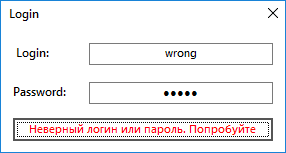
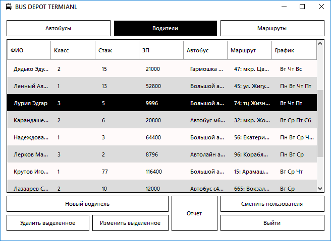

# Курсовая работа РГППУ Парфенов Н.А. ООП 2020г.
> Вариант 6: Автобусный парк
> Требуется разработать программную систему, предназначенную для диспетчера
> автобусного парка. 

**Использовано:**
- C# using Visual Studio
- MongoDB using NoSQLBooster

## Модели базы данных MongoDB | MongoDB Models:
### **Водитель** *Driver*
```csharp
    public partial class Driver
    {
        [BsonId]
        public ObjectId Id { get; set; }
        public string LastName { get; set; }
        public string Name { get; set; }
        public string Patronymic { get; set; }
        public int Grade { get; set; }
        public int Experience { get; set; }
        public float Salary { get; set; }
        public ObjectId BusId { get; set; }
        public ObjectId RouteId { get; set; }
        public List<string> Schedule { get; set; }
        public Driver()
        {
            Id = ObjectId.GenerateNewId();
            Schedule = new List<string>();
        }
    }
```
### **Маршрут** *Route*
```csharp
    public partial class Route
    {
        [BsonId]
        public ObjectId Id { get; set; }
        public int Number { get; set; }
        public string StPoint { get; set; }
        public string EndPoint { get; set; }
        public DateTime StTime { get; set; }
        public DateTime EndTime { get; set; }
        public int Interval { get; set; }
        public int Length { get; set; }
        public Route()
        {
            Id = ObjectId.GenerateNewId();
        }
    }
```
### **Автобус** *Bus*
```csharp
    public partial class Bus
    {
        [BsonId]
        public ObjectId Id { get; set; }
        public string Number { get; set; }
        public string Type { get; set; }
        public int Сapacity { get; set; }
        public ObjectId DriverId { get; set; }
        public bool IsWorking { get; set; }
        public Bus()
        {
            Id = ObjectId.GenerateNewId();
        }
    }
```

## Приложение | Application:

### Роли:
- **Диспетчер:**
    login:pwd: (reader:reader)
    права доступа: read-only
- **Диспетчер:**
    login:pwd: (admin:admin)
    права доступа: read-write
    
### Интерфейс:
- Логин:



- Главный экран:


- Добавление:


### Функции:
**Корректировка коллекций:**
- Добавление документов в коллекцию MongoDB:
```csharp
    public void InsertDocument<T>(string collectionName, T document)
        {
            var collection = db.GetCollection<T>(collectionName);
            collection.InsertOne(document);
        }
```
- Удаление документов из коллекции MongoDB:
```csharp
    public void DeleteDocument<T>(string collectionName, ObjectId id)
        {
            var collection = db.GetCollection<T>(collectionName);
            var filter = Builders<T>.Filter.Eq("Id", id);
            collection.DeleteOne(filter);
        }
```
**Чтение данных из коллекций:**
- Получить все документы коллекции MongoDB:
```csharp
    public List<T> LoadAllDocuments<T>(string collectionName)
        {
            var collection = db.GetCollection<T>(collectionName);
            return collection.Find(new BsonDocument()).ToList();
        }
```
- Получить документ из коллекции MongoDB по ObjectId:
```csharp
    public T LoadDocumentById<T>(string collectionName, ObjectId id)
        {
            var collection = db.GetCollection<T>(collectionName);
            var filter = Builders<T>.Filter.Eq("Id", id);
            return collection.Find(filter).First();
        }
```
